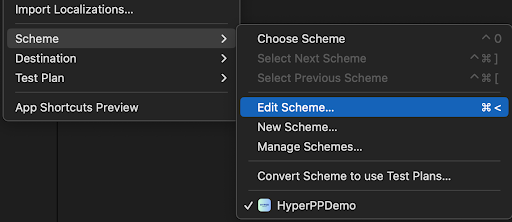
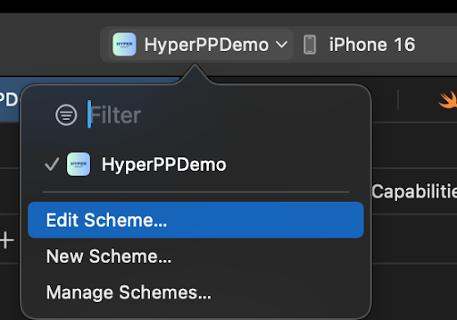
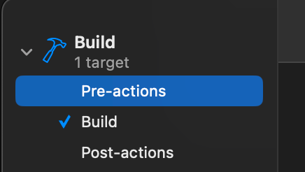
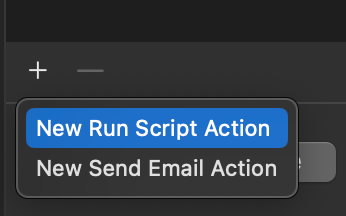
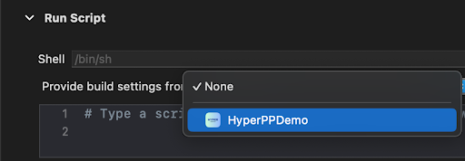

# HyperSDK

Hyper visualization and payment processing. Creates payment experiences for user to improve conversion and success rate.

## **Integration Guide**

To install the HyperSDK into your application via Swift Package Manager follow two steps:

1. Installing Assets Plugin  
2. Installing HyperSDK

Following sections describe how to complete above steps

## **1.1. Installing Assets Plugin**

HyperSDK depends on certain assets to function. These are available over the air and are supposed to be present while building the SDK. The Assets Plugin is a build time dependency that downloads all required assets and ensures the availability of the latest assets at build time.

To install Assets Plugin follow the below steps:

### **Step 1.1a \- Add Build Pre-actions Script**

In Xcode, go to the menu and select **Product** → **Scheme** → **Edit Scheme…**.

****

Alternatively, you can select your target from the scheme drop-down in Xcode's toolbar and choose **Edit Scheme...**.

</br>

In the Scheme Editor, expand **Build** and select **Pre-actions.**

</br>

Add a New Run Script Action.

</br>

Select the app target for **Provide build settings from**  

</br>


Paste the below shell script:

```shell
PACKAGE_DIR="${BUILD_DIR%Build/*}SourcePackages/artifacts/hypersdk-ios/HyperSDK"
XCFRAMEWORK_DIR="${PACKAGE_DIR}/HyperSDK.xcframework"
FUSE_SCRIPT="${PACKAGE_DIR}/Fuse.rb"
FUSE_MARKER="${XCFRAMEWORK_DIR}/.fuse_completed"
VALIDATION_SCRIPT="${PACKAGE_DIR}/ValidateHyperSDK.rb"

[ ! -f "$FUSE_MARKER" ] || [ "${ACTION}" == "clean" ] && { cd "${PROJECT_DIR}"; echo "Running Fuse.rb script..."; ruby "$FUSE_SCRIPT"; }

ruby "$VALIDATION_SCRIPT" && touch "$FUSE_MARKER" || exit 1
```

This Script will be executed whenever you do **Clean Build Folder**. 

### **Step 1.1b \- Add MerchantConfig.json**

The MerchantConfig.json contains the clientIds which helps the Assets plugin to download assets specific to your application. Create a .json file named MerchantConfig.json inside the app directory of your project. Add clientConfigs to this file. Please note to add this to the folder where the project file is present.

*Sample:*

```javascript
{
   "clientConfigs": {
	"your-client-id": {}
   }
}
```

## **1.2. Installing HyperSDK**

To install HyperSDK using Swift Package Manager follow the steps below:

### **Step 1.2.a \- Add SDK dependency to Package**

* In Xcode, select **File** → **Add Package Dependencies**…   
* Enter **`https://github.com/juspay/hypersdk-ios.git`**

Alternatively, you can add the following dependency to your Package.swift:

```
.package(url: "https://github.com/juspay/hypersdk-ios.git", .branch("main"))
```

### **Step 1.2.b \- Do Clean Build Folder**

This will download all the latest assets required for proper functioning of HyperSDK. You can see this output in Clean Build report logs:

\[HyperSDK\] HyperSDK version \- 2.2.3  
\[HyperSDK\] (your-client-id) Downloading assets from: https://public.releases.juspay.in/hyper/bundles/in.juspay.merchants/\<clientId\>/ios/release/assets.zip  
\[HyperSDK\] (your-client-id) Download complete\!  
\[HyperSDK\] (your-client-id) Extracting assets...  
\[HyperSDK\] Adding the required URL Schemes & Queries Schemes in plist files...  
\[HyperSDK\] Plist file path: HyperPPDemo/Info.plist  
\[HyperSDK\] Done.
